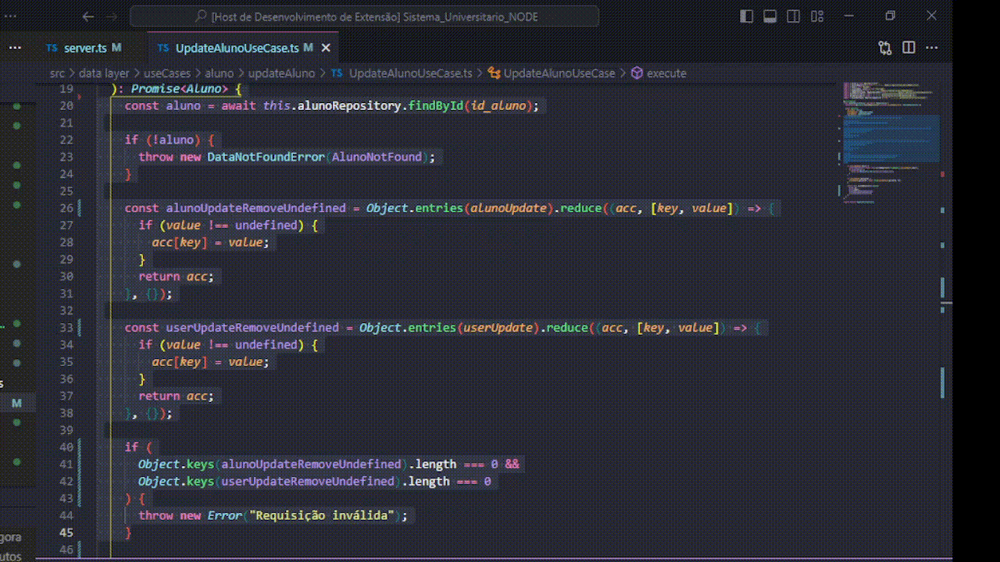
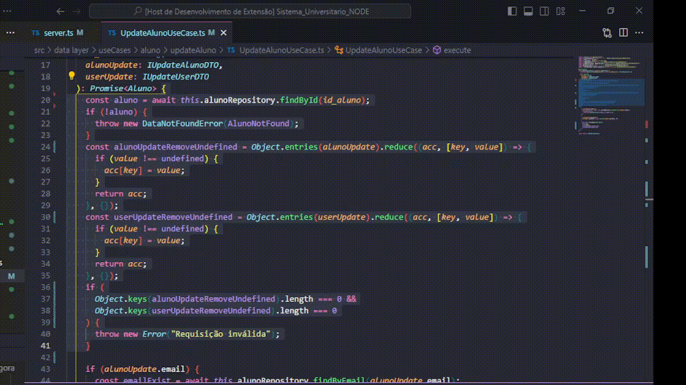
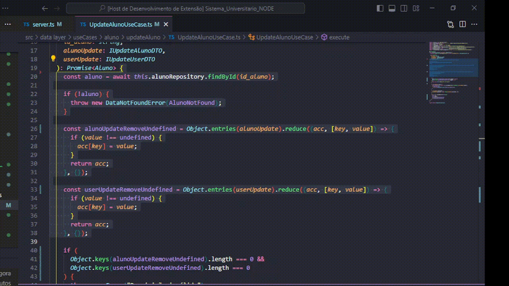
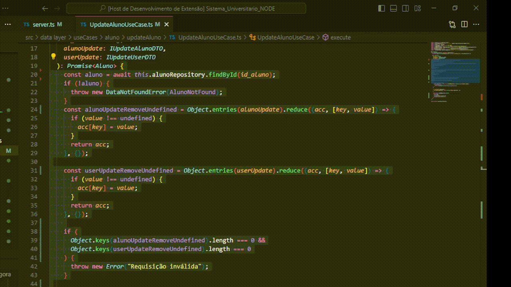
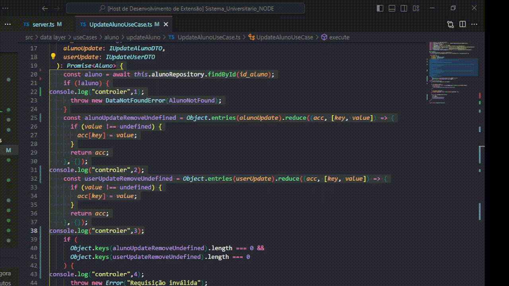

# Console Generator/Tracker for node js/ts

This extension was created with the goal of automating the generation of console.log statements for Node.js/TypeScript.

## Features

In the VSCode command palette

Generate console.log after each line without arguments:

Command: afterline

Generate console.log after each line with arguments:

Command: afterline params

Generate console.log for variables:

command: variables

Generate console.log after each blank line:

command: emptyLine

Clear console.log:

command: clear

## Observation

Initially, this extension was created for personal use; hence, the conditions adhere to the author's code standards. We will work on adding more standards based on feedback.

## For more information

- Email: jhon2italo@gmail.com

**Enjoy!**
